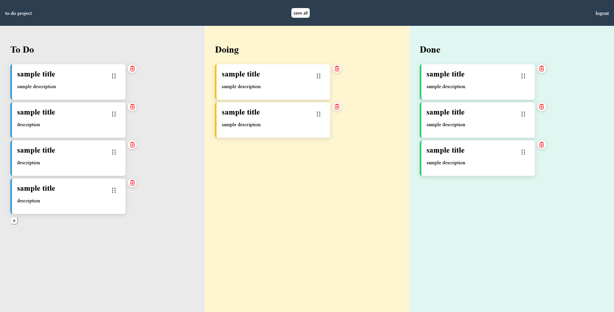

# task-tracker

Task Tracker is a web application built with Flask for tracking tasks and managing productivity using the kanban style.

## Installation

1. Clone the repository:
```bash
git clone https://github.com/Robin3880/task-tracker.git
cd task-tracker
```


2. Install dependencies:
```bash
pip install -r requirements.txt
```

3. Initialize the database:
```bash
python init_db.py
```

4. Run the application:
```bash
flask run
```

5. Access the application:

Open your web browser and go to http://localhost:5000 to use the Task Tracker.

## Preview

